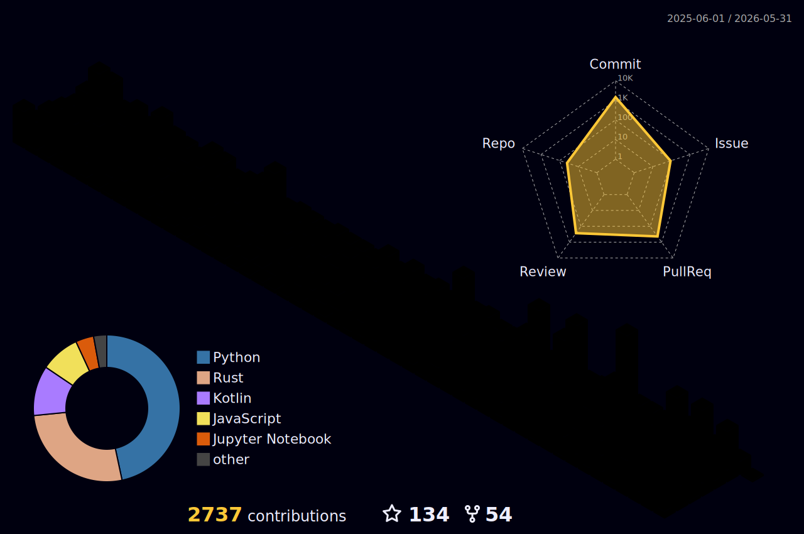

<div align="center">
  <picture>
    <source media="(prefers-color-scheme: dark)" srcset="https://capsule-render.vercel.app/api?type=waving&color=0:4A71D9%2C100:00c6ff&height=200&section=header&text=Onuralp%20Sezer&fontSize=50&fontColor=ffffff&animation=fadeIn&fontAlignY=35&desc=Senior%20Machine%20Learning%20Engineer%20@Ultralytics&descAlignY=55&descAlign=50">
    <source media="(prefers-color-scheme: light)" srcset="https://capsule-render.vercel.app/api?type=waving&color=0:E2E2E2%2C100:C9D6FF&height=200&section=header&text=Onuralp%20Sezer&fontSize=50&fontColor=000000&animation=fadeIn&fontAlignY=35&desc=Senior%20Machine%20Learning%20Engineer%20@Ultralytics&descAlignY=55&descAlign=50">
    
  </picture>
</div>

<div align="center">
  <a href="https://github.com/onuralpszr">
    <picture>
      <source media="(prefers-color-scheme: dark)" srcset="https://readme-typing-svg.demolab.com?font=Fira+Code&size=22&pause=1000&color=00c6ff&center=true&vCenter=true&width=600&lines=%3E_Initializing+neural+networks...;%3E_Loading+YOLO+weights...;%3E_Compiling+Rust+to+PTX...;%3E_Hello+World!+I'm+Onuralp+%F0%9F%91%8B">
      <source media="(prefers-color-scheme: light)" srcset="https://readme-typing-svg.demolab.com?font=Fira+Code&size=22&pause=1000&color=4A71D9&center=true&vCenter=true&width=600&lines=%3E_Initializing+neural+networks...;%3E_Loading+YOLO+weights...;%3E_Compiling+Rust+to+PTX...;%3E_Hello+World!+I'm+Onuralp+%F0%9F%91%8B">
      
    </picture>
  </a>
</div>

<p align="center">
    
    <a href="https://www.linkedin.com/in/osezer/"></a>
    <a href="https://user-badge.committers.top/turkey_public/onuralpszr">
     </a>
    <a href="https://huggingface.co/onuralpszr"></a>
    <a href="https://onuralpsezer.com"></a>
</p>

<p align="left">

👋 **Greetings Everyone!**

I'm **Onuralp**, a seasoned **Senior Machine Learning Engineer Lv2 @Ultralytics** with expertise in **Python 🐍**, **Kotlin 📱**, **C++ ⚙️**, and **Rust 🦀**. My passion lies in the dynamic fields of **Computer Vision 👁️**, **Machine Learning 🤖**, and **Deep Learning 🧠**. Beyond development, I have a strong foundation in **DevOps** and **MLOps**, ensuring seamless deployment, automation, and scalability of cutting-edge solutions 🚀.

### 🧠 `model.summary()`

```python
import torch.nn as nn

class Onuralp(nn.Module):
    def __init__(self):
        super().__init__()
        self.role = "Senior Machine Learning Engineer Lv2 @ Ultralytics"
        self.focus = ["Computer Vision 👁️", "Deep Learning 🧠", "MLOps ⚙️", "GPU Kernels ⚡"]
        self.languages = ["Python 🐍", "Kotlin 📱", "C++ ⚙️", "Rust 🦀", "CUDA PTX ⚡"]
        self.community = ["Fedora Project Contributor 🐧", "GDG Samsun Organizer 🎤"]

    def forward(self, coffee):
        code = self.write_code(coffee)
        models = self.train_yolo(code)
        return self.deploy_to_edge(models)
```

### 🚀 `inference_pipeline.run()`

I specialize in building, optimizing, and deploying state-of-the-art Computer Vision models. From training **YOLO** architectures at [Ultralytics](https://github.com/ultralytics/ultralytics) to optimizing inference with **ONNX**, **TensorRT**, and **ExecuTorch**, I bridge the gap between research and production.

* 🔭 **Currently working on:** Pushing the boundaries of real-time object detection and tracking at **Ultralytics**.
* 🌱 **Currently exploring:** Vision-Language Models (VLMs), Edge AI, Rust-based ML inference, and GPU kernel programming with [cuda-oxide](https://nvlabs.github.io/cuda-oxide/).
* 💬 **Ask me about:** YOLO, PyTorch, Computer Vision, Open Source, and Fedora Linux.

### 🧬 `model.fit(epochs=1000)`

<div align="center">

| `Epoch 1` | `Epoch 50` | `Epoch 100` |
|:---:|:---:|:---:|
| 🔲🔳🔲🔳🔳🔲🔳🔲<br>🔳🔲🔳🔲🔲🔳🔲🔳<br>🔲🔳🔲🔳🔳🔲🔳🔲<br>🔳🔲🔳🔲🔲🔳🔲🔳<br>🔲🔳🔲🔳🔳🔲🔳🔲<br>🔳🔲🔳🔲🔲🔳🔲🔳<br>🔲🔳🔲🔳🔳🔲🔳🔲<br>🔳🔲🔳🔲🔲🔳🔲🔳 | ⬛⬛⬛🟪🟪⬛⬛⬛<br>⬛⬛🟪🟪🟪🟪⬛⬛<br>⬛🟪🟪🟪🟪🟪🟪⬛<br>⬛🟪🟪🟪🟪🟪🟪⬛<br>⬛⬛🟪🟪🟪🟪⬛⬛<br>⬛⬛⬛🟪🟪⬛⬛⬛<br>⬛⬛⬛⬛⬛⬛⬛⬛<br>⬛⬛⬛⬛⬛⬛⬛⬛ | 🟥🟥🟥🟥🟥🟥🟥🟥<br>🟥⬛⬛⬛⬛⬛⬛🟥<br>🟥⬛🟦⬛⬛🟦⬛🟥<br>🟥⬛⬛⬛⬛⬛⬛🟥<br>🟥⬛⬛🟦🟦⬛⬛🟥<br>🟥⬛⬛⬛⬛⬛⬛🟥<br>🟥🟥🟥🟥🟥🟥🟥🟥<br>⬛⬛⬛⬛⬛⬛⬛⬛ |
| *Raw Data (Noise)* | *Feature Extraction* | *YOLO Object Detected!* |

</div>

```console
[Epoch 001] 🟢⚪⚪⚪⚪⚪⚪⚪⚪⚪ (Learning Python & C++)
[Epoch 050] 🟢🟢🟢⚪⚪⚪⚪⚪⚪⚪ (Mastering Computer Vision & OpenCV)
[Epoch 100] 🟢🟢🟢🟢🟢⚪⚪⚪⚪⚪ (Training YOLO & Deep Learning Models)
[Epoch 500] 🟢🟢🟢🟢🟢🟢🟢⚪⚪⚪ (Optimizing with ONNX, TensorRT & Rust)
[Epoch 999] 🟢🟢🟢🟢🟢🟢🟢🟢🟢🟢 (Deploying AI @ Ultralytics 🚀)

> Model 'Onuralp' successfully converged.
> Current State: Senior ML Engineer Lv2
> Next Objective: AGI & Beyond...
```

### 🐧 Open Source & Community

I am a long-term [**Contributor and Mindshare Member, Fedora KDE SIG Member, Fedora Website and Apps Team Member, and RPM Packager**](https://fedoraproject.org/wiki/User:onuralpszr) at the **Fedora Project**. As an RPM packager, I actively maintain and package Python, KDE, Qt and AI/ML-related libraries for Fedora Linux helping bring cutting-edge open source tools to millions of users through the official Fedora repositories. I am also an **Organizer and Speaker** at [**GDG Samsun**](https://github.com/gdgsamsun), where I share insights on **Deep Learning**, **Machine Learning**, **Computer Vision**, and **Vision-Language Models (VLMs)**.

In addition to my community work, I contribute to a variety of **FLOSS** and **OSS** projects across GitHub, GitLab, and Pagure always aiming to build together and make open source a better place for everyone.

### 📦 `rpm --build-pipeline`

<div align="center">

| `%prep` | `%build` | `%install` | `%check` | `dnf install` |
|:---:|:---:|:---:|:---:|:---:|
| 🔵⚪⚪⚪⚪ | 🔵🔵⚪⚪⚪ | 🔵🔵🔵⚪⚪ | 🔵🔵🔵🔵⚪ | 🔵🔵🔵🔵🔵 |
| *Patch & unpack sources* | *Compile & link* | *Stage files* | *Run tests* | *Ship to users!* |

</div>

```console
$ fedpkg clone python-awesome-package && cd python-awesome-package
$ fedpkg prep       # ✅ Sources verified, patches applied
$ fedpkg build      # ✅ RPM built successfully
$ fedpkg mockbuild  # ✅ Mock build passed (x86_64, aarch64)
$ fedpkg push && fedpkg submit  # 🚀 Submitted to Bodhi
> Update pushed to stable → reaching ~40M Fedora users
```

### ⚡ `cuda_oxide::kernel::launch()`

Currently exploring **[cuda-oxide](https://nvlabs.github.io/cuda-oxide/)** an experimental Rust-to-CUDA compiler from NVIDIA Research that compiles safe(ish), idiomatic Rust directly to PTX. No CUDA C, no DSLs, no foreign bindings — just Rust running on the GPU.

<div align="center">

| `Grid` | `Block 0` | `Block 1` | `Block 2` | `Block 3` |
|:---:|:---:|:---:|:---:|:---:|
| `Warp 0..3` | 🟩🟩🟩🟩🟩🟩🟩🟩 | 🟦🟦🟦🟦🟦🟦🟦🟦 | 🟨🟨🟨🟨🟨🟨🟨🟨 | 🟥🟥🟥🟥🟥🟥🟥🟥 |
| `SIMT` | *all threads run the same instruction* | ← | ← | ← |

</div>

```rust
// 🦀 Safe(ish) GPU kernel — Rust compiles straight to PTX
#[kernel]
pub unsafe fn vector_add(a: &[f32], b: &[f32], c: &mut [f32]) {
    let tid = thread::index_1d() as usize;
    if tid < c.len() {
        c[tid] = a[tid] + b[tid]; // thousands of threads, one instruction
    }
}
```

```console
$ cargo build --target nvptx64-nvidia-cuda
   Compiling cuda-kernel v0.1.0
   ✅ Rust  -> LLVM IR  ->  PTX   (no CUDA C required)
   ✅ Kernel compiled: vector_add.ptx
   ✅ Loaded onto device: NVIDIA GPU
> Launching 4096 threads across 128 warps...
> All threads converged. ✅
> Status: still learning — but the 🦀 loves the GPU
```

### 🔧 `deploy::stack()`

```python
stack = {
    "backend":   ["Python", "FastAPI", "Django", "Flask"],
    "mobile":    ["Kotlin", "Flutter", "ARCore", "MediaPipe", "Firebase"],
    "inference": ["ONNX Runtime", "TensorRT", "ExecuTorch", "ncnn", "Vulkan"],
    "training":  ["PyTorch", "Ultralytics", "TensorFlow", "JAX", "Keras"],
    "gpu":       ["CUDA", "cuda-oxide", "PTX", "NVIDIA TensorRT"],
}
```

On the backend, I primarily use **Python**, while on the mobile side, I work with **Kotlin** and **Flutter**, leveraging Google technologies such as [ARCore](https://developers.google.com/ar), [MediaPipe](https://mediapipe.dev/), [Firebase](https://firebase.google.com/), [FlatBuffers](https://flatbuffers.dev/), [ONNX Runtime](https://onnxruntime.ai/), and [ncnn](https://github.com/Tencent/ncnn).  

On the ML side, I work extensively with [Ultralytics](https://github.com/ultralytics/ultralytics), where I am a **Senior Machine Learning Engineer**, developing and maintaining cutting-edge computer vision tools and YOLO models. My primary deep learning framework is **[PyTorch](https://pytorch.org/)**, which I use for model training, fine-tuning, and deployment workflows.

I also contribute to related open-source projects such as [ExecuTorch](https://github.com/pytorch/executorch) an efficient on-device inference framework from **PyTorch**, and [ONNXSlim](https://github.com/inisis/OnnxSlim) a lightweight ONNX optimization toolkit.  

In addition, I have experience with other frameworks like [TensorFlow](https://www.tensorflow.org), [TensorBoard](https://www.tensorflow.org/tensorboard), [Keras](https://keras.io/), and [JAX](https://github.com/google/jax), which I occasionally use for experimentation and cross-framework integration.  

### 🌍 `oss::contributions()`

```rust
let platforms = vec!["GitHub", "GitLab", "Pagure"];
let mission   = "build together — make open source better for everyone 🌍";
```

In addition to my diverse skill set, I am actively contributing and co-maintaner to a computer vision project named [sahi](https://github.com/obss/sahi) is an open-source project that provides a simple and efficient way to perform slicing-based inference for object detection models. It is designed to work with various deep learning frameworks and models, making it a versatile tool for computer vision tasks. In past I was a co-maintaner to [Supervision](https://supervision.roboflow.com/). [Supervision](https://supervision.roboflow.com/) is dedicated to crafting reusable computer vision tools tailored to a wide array of needs. These projects are embodies my commitment to advancing the field of computer vision, offering robust solutions that empower developers and researchers alike.

I am also contributing various FLOSS and OSS projects around GitHub/Gitlab/Pagure and other platforms to make everyone happy and doing better projects together.

### 🌱 Hacktoberfest Journey

I’ve proudly participated in **Hacktoberfest** every year since **2022**, completing four consecutive years (2022, 2023, 2024, 2025).  
Through this journey, I’ve contributed dozens of PRs, met inspiring developers from around the world, and grown both technically and personally.  

💚 For me, Hacktoberfest isn’t just about code, it’s about **people, learning, and giving back to the community**. I’m also part of the **Holopin x Hacktoberfest: 10 Badge Club**, celebrating those who’ve contributed continuously since 2022. And yes, somewhere out there, **a tree is growing in my name** — a small but meaningful reminder that code can make a difference beyond the screen 🌍.

### 🧩 Let’s Connect

I’m always open to collaborating, contributing, or just talking about open source, computer vision, and AI.  
Feel free to reach out or check out my latest work here on GitHub! 🚀

</p>

<br>
<br>
<p align="center">
  </img>
  </img>
</p>

Here is my Arsenal Tools and Skills I use;

<h3 align="left">Programming</h3>
<p>
    </img>
    </img>
    </img>
    </img>
    </img>
    </img>
    </img>
    </img>
    </img>
    </img>
    </img>

</p>

<h3 align="left">Backend-as-a-Service (Baas)</h3>
<p>
   </img>
      </img>
</p>

<h3 align="left">Web Servers</h3>
<p>
   </img>
   </img>
   </img>
</p>

<h3 align="left">Framework & Libraries</h3>
<p>
  </img>
  </img>
  </img>
  </img>
  </img>
  </img>
  </img>
  </img>
  </img>
  </img>
  </img>
  </img>
  </img>
  </img>
  </img>
  </img>
   <a href="#"></a>
</p>

<h3 align="left">Game Engines</h3>
<p>
    </img>
    </img>
    </img>

</p>

<h3 align="left">Databases</h3>
<p>
    <a href="#"></a>
    <a href="#"></a>
    <a href="#"></a>
    <a href="#"></a>
</p>

<h3 align="left">VPN Servers</h3>
<p>
    <a href="#"></a>
    <a href="#"></a>
</p>

<h3 align="left">Virtualization Platforms</h3>
<p>
    <a href="#"></a>
    <a href="#"></a>
    <a href="#"></a>
    <a href="#"></a>
</p>

<h3 align="left">Software and tools</h3>
<p>
    <a href="#"></a>
    <a href="#"></a>
    <a href="#"></a>
    <a href="#"></img></a>
    <a href="#"></img></a>
    <a href="#"></img></a>
    <a href="#"></img></a>
    <a href="#"></img></a>
    <a href="#"></a>
    <a href="#"></a>
    <a href="#"></a>
    <a href="#"></a>
    <a href="#"></a>
    <a href="#"></a>
    <a href="#"></a>
    <a href="#"></a>
    <a href="#"></a>
    <a href="#"></a>
    <a href="#"></a>
    <a href="#"></a>
    <a href="#"></a>
</p>

<h3 align="left">Linux Distributions</h3>
<p>
    <a href="#"></a>
    <a href="#"></a>
    <a href="#"></a>
    <a href="#"></a>
    <a href="#"></a>
    <a href="#"></a>
</p>

<h3 align="left">Platforms</h3>
<p>
    <a href="#"></a>
    <a href="#"></a>
    <a href="#"></a>
</p>

<h3 align="left">Cloud Providers</h3>
<p>
    <a href="#"></a>
    <a href="#"></a>
    <a href="#"></a>
</p>

## ⚙️ `projects::active()`

| Project | Role | Description |
|:---|:---:|:---|
| [Ultralytics](https://github.com/ultralytics/ultralytics) | `Co-Maintainer` | World's leading YOLO framework — detection, segmentation, pose estimation |
| [Ultralytics Inference](https://github.com/ultralytics/inference) | `Main Maintainer` | 🦀 High-performance YOLO inference in Rust with ONNX Runtime |
| [TrackForge](https://github.com/onuralpszr/trackforge) | `Main Maintainer` | CV tracking library in Rust + Python bindings (ByteTrack, DeepSORT) |
| [SAHI](https://github.com/obss/sahi) | `Co-Maintainer` | Slicing Aided Hyper Inference for object detection on large images |
| [CvCamera-Mobile](https://github.com/onuralpszr/CvCamera-Mobile) | `Main Maintainer` | Android CV camera template with OpenCV and real-time ML |
| [GFPGAN-ncnn-vulkan](https://github.com/onuralpszr/GFPGAN-ncnn-vulkan) | `Main Maintainer` | Face restoration via GFPGAN, accelerated with ncnn + Vulkan |
| [ExecuTorch](https://github.com/pytorch/executorch) | `Contributor` | PyTorch on-device inference framework for edge and mobile |
| [YOLO-World](https://github.com/AILab-CVC/YOLO-World) | `Contributor` | Real-time open-vocabulary object detection via text prompts |
| [KDE](https://kde.org/) | `Contributor` | KDE ecosystem — Linux desktop and open-source community |

## 📜 `projects::past()`

| Project | Description |
|:---|:---|
| [Supervision](https://github.com/roboflow/supervision) | Reusable CV tools for detections, annotations, and datasets — former co-maintainer |
| [Supervision Conda Forge](https://github.com/conda-forge/supervision-feedstock) | Conda package distribution for Supervision |
| [Gemma Cookbook](https://github.com/google-gemini/gemma-cookbook) | Guides and examples for Google Gemma |
| [Sceneview-android](https://github.com/SceneView/sceneview-android) | ARCore and 3D rendering for Android |
| [Sceneform-android](https://github.com/SceneView/sceneform-android) | ARCore SDK for Android from the SceneView team |
| [Nvidia Auto Installer](https://github.com/t0xic0der/nvidia-auto-installer-for-fedora) | Automated NVIDIA driver installer for Fedora Linux |

## 🔗 `links::connect()`

<p align="center">
  <a href="https://www.linkedin.com/in/osezer/"></a>
  <a href="https://twitter.com/onuralpszr"></a>
  <a href="https://huggingface.co/onuralpszr"></a>
  <a href="https://www.credly.com/users/onuralp-sezer/badges"></a>
  <a href="https://developers.google.com/profile/u/onuralpsezer"></a>
  <a href="https://www.cloudskillsboost.google/public_profiles/aa921c43-e963-4266-aa26-e7465dab9aec"></a>
  <a href="https://ask.fedoraproject.org/u/thunderbirdtr/"></a>
  <a href="https://pagure.io/user/thunderbirdtr"></a>
  <a href="https://src.fedoraproject.org/user/thunderbirdtr/"></a>
  <a href="https://fedoraproject.org/wiki/User:Thunderbirdtr"></a>
  <a href="https://badges.fedoraproject.org/user/thunderbirdtr"></a>
</p>

## 🤝 `mentorship::programs()`

<p align="center">
  <a href="https://github.com/outreachy"></a>
  <a href="https://github.com/OpenTRFoundation/OpenTR"></a>
</p>

## 🙌 `volunteer::work()`

<p align="center">
  <a href="https://fedoraproject.org/wiki/User:Thunderbirdtr"></a>
  <a href="https://kde.org/"></a>
  <a href="https://www.opensuse.org/"></a>
  <a href="https://gdg.community.dev/gdg-samsun/"></a>
  <a href="https://gdgsamsun.org/"></a>
</p>

## 🏅 `certifications::earned()`

<p align="center">
  <a href="https://www.credential.net/5d4c2d99-4c0b-4990-9399-2bdb496f7d4f#gs.axwujf"></a>
  <a href="#"></a>
</p>



[](https://holopin.io/@osezer)


