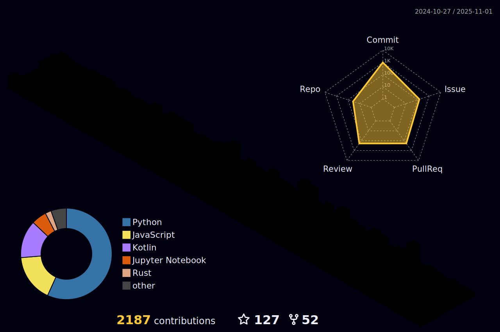

    
    

Greetings! I'm Onuralp, a seasoned Senior Software Engineer proficient in Python, Kotlin, C++, Rust and OpenCV. My expertise lies in the captivating realms of AR, Machine Learning, Deep Learning, and Computer Vision. Engaging in extensive DevOps and MLOps practices further complements my skill set. 

I am a long term <a href="https://fedoraproject.org/wiki/User:onuralpszr"> Contributor and Mindshare Member,Fedora KDE SIG Member,Fedora Website and Apps Team Member and RPM Packager</a> at Fedora Project.

Professionally, I use Python development on backend side of works and on mobile side I used Kotlin and flutter with Google technologies such as <a href="https://developers.google.com/ar">ARCore</a>,<a href="https://mediapipe.dev/">Mediapipe</a>,<a href="https://firebase.google.com/">Firebase</a>,<a href="https://protobuf.dev/">Protobuf</a>,<a href="https://flatbuffers.dev/">FlatBuffers</a> and many others. On machine learning sides I used <a href="https://www.tensorflow.org">Tensorflow</a>,<a href="https://www.tensorflow.org/tensorboard">Tensorboard</a>,<a href="https://keras.io/">Keras</a>,<a href="https://github.com/google/jax">Jax</a>,<a href="https://www.pytorch.org">Pytorch</a>. These tools enable me to incorporate ML/DL/AI into apps and products. Additionally, I use the Unity engine for creating AR and ML applications.

I am also contributing various FLOSS and OSS projects around GitHub/Gitlab/Pagure and other platforms to make everyone and developers lives better.

 
 

  </img>
  </img>

Here is my Arsenal Tools and Skills I use;

<h3 align="left">Programming</h3>

    </img>
    </img>
    </img>
    </img>
    </img>
    </img>
    </img>
    </img>
    </img>
    </img>

<h3 align="left">Backend-as-a-Service (Baas)</h3>

   </img>
      </img>

<h3 align="left">Web Servers</h3>

   </img>
   </img>
   </img>

<h3 align="left">Framework & Libraries</h3>

 
  </img>
  </img>
  </img>
  </img>
  </img>
  </img>
  </img>
  </img>
  </img>
  </img>
  </img>
  </img>
  </img>
  </img>
  </img>
  </img>
   

<h3 align="left">Game Engines</h3>

    </img>
    </img>
    </img>

<h3 align="left">Databases</h3>

    
    
    
    

<h3 align="left">VPN Servers</h3>

    
    

<h3 align="left">Virtualization Platforms</h3>

    
    
    
    

<h3 align="left">Software and tools</h3>

    
    
    
    <a href="#"></img></a>
    <a href="#"></img></a>
    <a href="#"></img></a>
    <a href="#"></img></a>
    <a href="#"></img></a>
    
    
    
    
    
    
    
    
    
    
    
    
    

<h3 align="left">Linux Distributions</h3>

    
    
    
    
    
    

<h3 align="left">Platforms</h3>

    
    
    

<h3 align="left">Cloud Providers</h3>

    
    
    

## Current project(s) I'm working/worked on,

- [Supervision](https://github.com/roboflow/supervision)
- [Ear-segmentation-ai](https://github.com/umitkacar/Ear-segmentation-ai)
- [GFPGAN-ncnn-vulkan](https://github.com/onuralpszr/GFPGAN-ncnn-vulkan)
- [CvCamera-Mobile](https://github.com/onuralpszr/CvCamera-Mobile)
- [Sceneview-android](https://github.com/SceneView/sceneview-android)
- [Sceneform-android from Sceneview Team](https://github.com/SceneView/sceneform-android)
- [Nvidia Auto Installer](https://github.com/t0xic0der/nvidia-auto-installer-for-fedora)
- [Ultralytics](https://github.com/ultralytics/ultralytics)

## Useful links
If you want to stay in touch with me, these links can be useful.
 
- [LinkedIn](https://www.linkedin.com/in/osezer/)
- [AskFedora account](https://ask.fedoraproject.org/u/thunderbirdtr/)
- [Twitter](https://twitter.com/onuralpszr)
- [Fedora Pagure Account](https://pagure.io/user/thunderbirdtr)
- [Src.Fedora Account ](https://src.fedoraproject.org/user/thunderbirdtr/)
- [Credly](https://www.credly.com/users/onuralp-sezer/badges)
- [Google Developer Account](https://developers.google.com/profile/u/onuralpsezer)
- [Personal Fedora wiki page](https://fedoraproject.org/wiki/User:Thunderbirdtr)
- [Fedora Contribution Badges](https://badges.fedoraproject.org/user/thunderbirdtr)
- [Google Cloud Skill Boost Profile](https://www.cloudskillsboost.google/public_profiles/aa921c43-e963-4266-aa26-e7465dab9aec)

